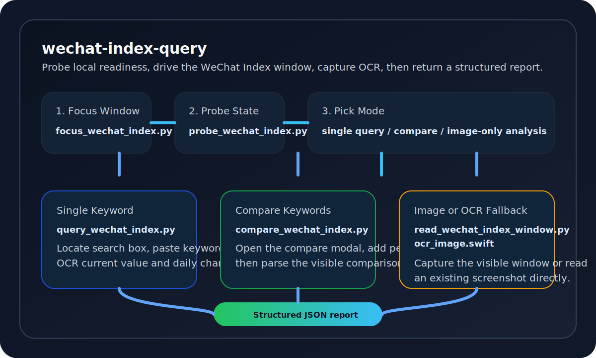
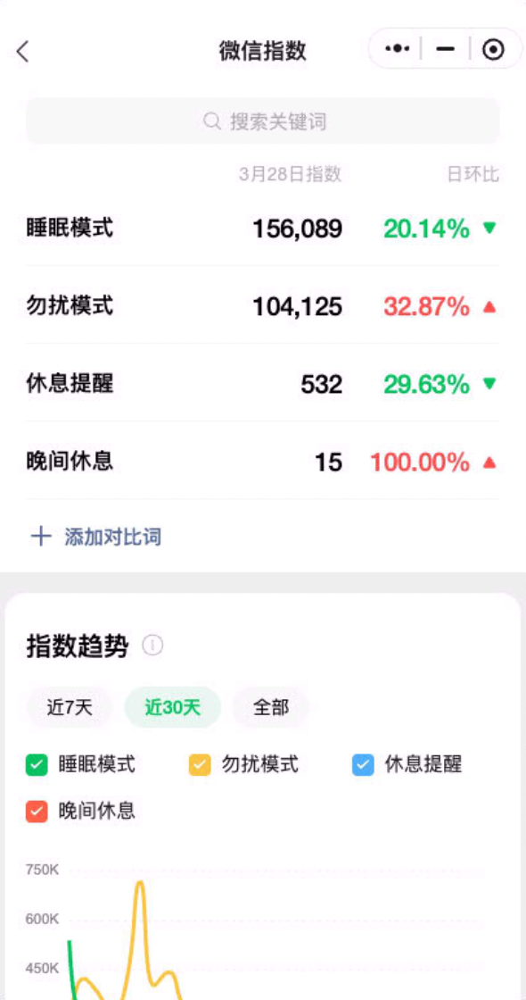
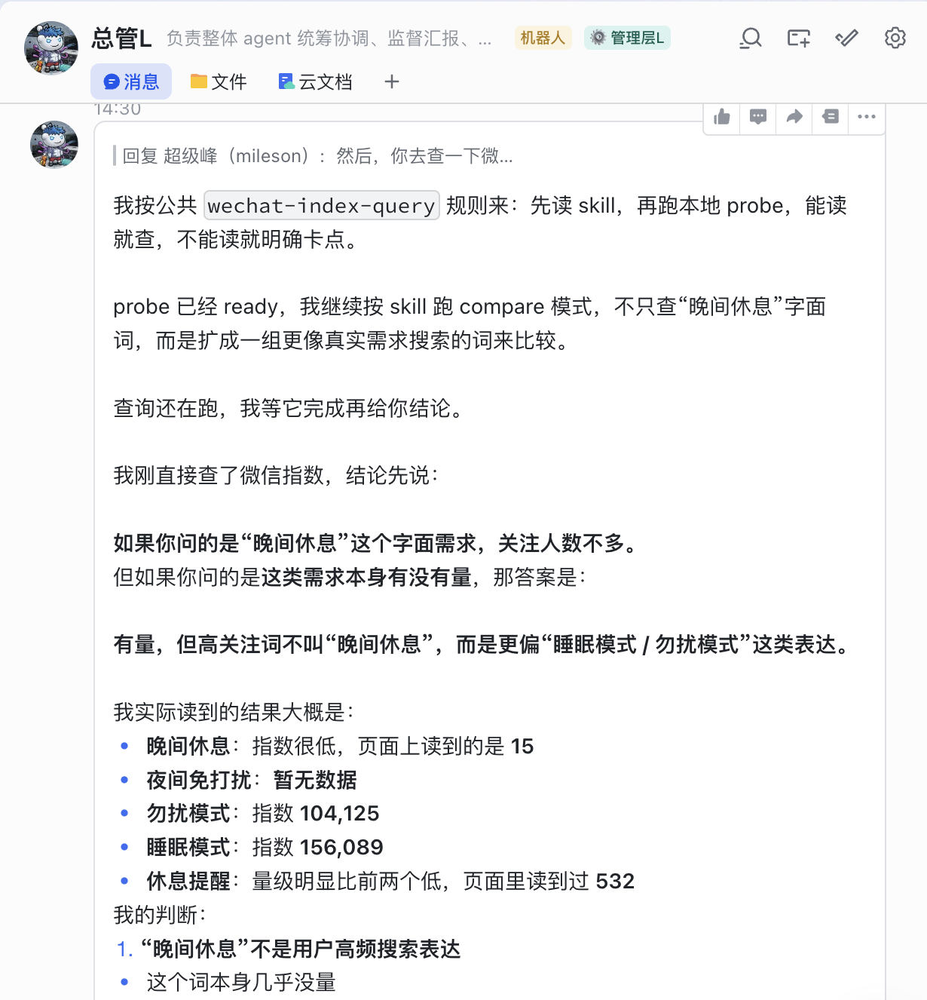

# wechat-index-query

> macOS desktop-assisted automation for querying and comparing the WeChat mini program `微信指数`.

[](LICENSE)
[](#requirements)
[](#requirements)
[](#quick-start)

[简体中文](README_CN.md)



## What It Does

`wechat-index-query` is a local skill bundle for OpenClaw, Codex, or any desktop automation workflow that needs to query `微信指数` on macOS. It focuses the WeChat mini program window, probes local permissions, captures the visible area, runs Vision OCR, and returns a structured report for single-keyword, compare-keyword, or screenshot-assisted analysis.

## Features

- Desktop-ready probe for Accessibility, Screen Recording, and WeChat window state
- Single-keyword query flow for direct WeChat Index lookup
- Compare mode that uses the mini program's `添加对比词` flow
- Screenshot OCR mode for analyzing an existing image without driving the UI
- Structured JSON report output for downstream automation and summarization
- Promptable skill format with routing rules for OpenClaw or Codex agents
- No third-party Python dependencies in the core scripts

## Screenshots

<table>
  <tr>
    <td width="42%">
      
    </td>
    <td width="58%">
      
    </td>
  </tr>
  <tr>
    <td><strong>WeChat Index compare page</strong><br/>The mini program shows keyword scores, day-over-day change, and the visible trend area.</td>
    <td><strong>OpenClaw decision output</strong><br/>A structured summary can be posted back to chat after the query completes.</td>
  </tr>
</table>

## Requirements

- macOS 13 or later
- WeChat desktop installed and logged in
- WeChat mini program window named `微信指数` available under process `WeChat`
- Xcode Command Line Tools with `/usr/bin/swift`
- Python 3.11 or later
- Accessibility permission for the host app or shell
- Screen Recording permission for OCR and screenshot capture

## Quick Start

1. Open the WeChat mini program window named `微信指数`.
2. Grant Accessibility and Screen Recording permissions to the terminal or host app.
3. Run the readiness probe.

```bash
python3 scripts/probe_wechat_index.py
```

4. Bring the window to the foreground when needed.

```bash
python3 scripts/focus_wechat_index.py
```

5. Run one of the supported modes.

Single keyword:

```bash
python3 scripts/run_wechat_index_report.py "车牌查询"
```

Compare keywords:

```bash
python3 scripts/run_wechat_index_report.py --compare "查车牌" "车牌查询" "挪车电话"
```

Analyze an existing screenshot:

```bash
python3 scripts/run_wechat_index_report.py --image /absolute/path/to/wechat-index.png
```

## Execution Model

```text
+-------------------+      +----------------------+      +------------------+
| focus_wechat_*    | ---> | probe_wechat_*       | ---> | read / OCR layer |
+-------------------+      +----------------------+      +------------------+
          |                           |                             |
          v                           v                             v
+-------------------+      +----------------------+      +------------------+
| query keyword     |      | compare keywords     |      | image-only mode  |
+-------------------+      +----------------------+      +------------------+
          \___________________________    __________________________/
                                      \  /
                                       \/
                              +----------------------+
                              | structured JSON      |
                              | summary and advice   |
                              +----------------------+
```

## Agent Prompt

Use this repository as a skill bundle when a user asks to query, compare, or interpret WeChat Index keywords on macOS.

```text
Use the `wechat-index-query` skill for requests such as:
- 查询微信指数关于 XXX
- 对比 A、B、C 的微信指数
- 看这张微信指数截图

Workflow:
1. Run `python3 scripts/focus_wechat_index.py`
2. Run `python3 scripts/probe_wechat_index.py`
3. If probe status is `ready`, choose single, compare, or image mode
4. If probe is not ready, explain the blocker and switch to screenshot-assisted analysis
5. Summarize with the template in `template.md`
```

## Project Structure

```text
.
|-- SKILL.md
|-- README.md
|-- README_CN.md
|-- template.md
|-- examples/
|   `-- sample.md
|-- references/
|   `-- permissions.md
`-- scripts/
    |-- probe_wechat_index.py
    |-- focus_wechat_index.py
    |-- query_wechat_index.py
    |-- compare_wechat_index.py
    |-- read_wechat_index_window.py
    |-- run_wechat_index_report.py
    |-- wechat_index_common.py
    |-- back_wechat_index.py
    |-- click_at.swift
    |-- paste_keyword_at.swift
    `-- ocr_image.swift
```

## Verification

Local verification for this repository can be kept lightweight before a real WeChat session is available:

```bash
python3 -m py_compile scripts/*.py
python3 scripts/run_wechat_index_report.py --help
python3 scripts/probe_wechat_index.py
```

The last command requires macOS desktop permissions and a visible `微信指数` window to enter full mode.

## Contributing

See [CONTRIBUTING.md](CONTRIBUTING.md) for development guidelines, verification steps, and documentation expectations.

## Security

See [SECURITY.md](SECURITY.md). Please do not disclose desktop automation or permission bypass issues in a public issue.

## Releases

Initial release notes live at [docs/releases/v0.1.0.md](docs/releases/v0.1.0.md). A tag-based GitHub Actions workflow is included to publish release notes and bundled visual assets.

## License

MIT License. See [LICENSE](LICENSE).

## 作者
- X: [Mileson07](https://x.com/Mileson07)
- 小红书: [超级峰](https://xhslink.com/m/4LnJ9aB1f97)
- 抖音: [超级峰](https://v.douyin.com/rH645q7trd8/)
